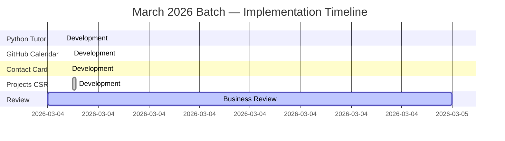
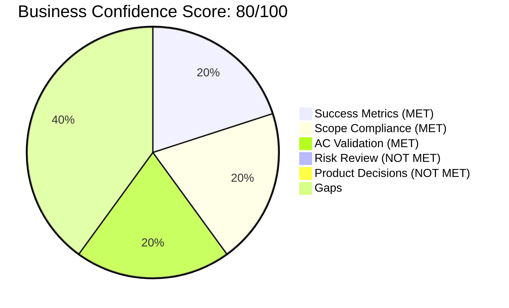

# Business Review: March 2026 Implementation Batch
**Date**: 2026-03-04
**Spec**: No formal specs — assessed against backlog.md and portfolio site value criteria
**Confidence Score**: 80/100
**Verdict**: CONDITIONALLY APPROVED

---

## Assessment Summary

| Area | Status | Notes |
|------|--------|-------|
| Success Metrics | MET | All 4 changes deliver measurable portfolio value; GitHub API rate limit is the one untracked risk signal |
| Scope Compliance | MET | All 4 backlog items fully delivered, no scope creep identified |
| AC Business Validation | MET | Features work as intended for end users; one UX gap in Python Tutor (no mobile layout warning) |
| Risk Review | NOT MET | Two unmitigated risks remain: GitHub API unauthenticated rate limit (60 req/hr) and ghchart.rshah.org external CDN with no fallback |
| Product Decisions | NOT MET | Two open decisions: (1) whether to add a GitHub token via env var for API rate relief, (2) attribution clarity for Python Tutor tool name conflict |

---

## Feature Timeline



---

## Roadmap Status

No roadmap file found (`docs/specs/feature-roadmap.md` does not exist) — skipped.

The backlog serves as the informal roadmap. All 4 reviewed items are now marked `[x]` Done.

---

## Confidence Breakdown



---

## Dependency & Risk Map

```mermaid
flowchart LR
    PY[Pyodide CDN\nv0.27.4] -->|hard dep| PT[Python Tutor]
    GH[GitHub REST API\nunauthenticated] -->|hard dep| RG[RepoGrid CSR]
    GC[ghchart.rshah.org\n3rd-party CDN] -->|hard dep| CAL[Activity Calendar]
    PT -->|showcases| LAB[/lab page]
    RG -->|populates| PROJ[/projects page]
    CAL -->|decorates| PROJ
    CC[ContactCard] -->|anchors| HOME[/ hub page]

    style GH fill:#EF4444,color:#fff
    style GC fill:#F59E0B,color:#000
    style PY fill:#F59E0B,color:#000
    style PT fill:#10B981,color:#fff
    style RG fill:#10B981,color:#fff
    style CAL fill:#10B981,color:#fff
    style CC fill:#10B981,color:#fff
```

Legend: Red = unmitigated risk, Yellow = monitoring required, Green = healthy

---

## Detailed Assessment

### Success Metrics

No formal KPIs were defined upfront (no spec existed for this batch). Assessed against the portfolio site's four value dimensions:

**Visitor experience**
- Python Tutor delivers a genuinely interactive experience: users can load any of 6 presets or write custom code, step through execution line by line with keyboard shortcuts, and see stack frames + heap objects update in real time. This is a level of interactivity well above the typical portfolio tool. Value: high.
- The GitHub Activity Calendar provides instant social proof of coding activity without requiring a click-through to GitHub. Value: medium-high.
- Contact Card simplification is a strict improvement: removed non-functional UI (social badges with no backing data) and surfaced the one actionable link (email). Cleaner and more honest. Value: medium.

**Professional presentation**
- CSR migration for repos means the grid always shows the current state of the GitHub profile — no stale build-time snapshots. For a developer portfolio, showing live data is a credibility signal. Value: medium-high.

**Technical showcase**
- Python Tutor is the standout: implementing `sys.settrace` in Pyodide, encoding the heap graph with reference tracking, and rendering pointer arrows demonstrates non-trivial front-end engineering. The "beta" badge is appropriate; this is the most complex lab tool on the site. Value: very high.

**Site reliability**
- CSR migration introduces two new runtime dependencies (GitHub API + ghchart CDN) that were not present at build time. Both lack fallback behavior beyond an error state. See Risk section.

**Overall**: All 4 items deliver net positive value. No changes regressed existing functionality.

---

### Scope Compliance

All 4 backlog items are marked `[x]` Done and the implementation matches the description:

| Backlog Item | Delivered | Notes |
|---|---|---|
| Python Tutor (sys.settrace + Pyodide) | Yes | Full visualizer at `/lab/python-tutor` with stack, heap, output panels |
| GitHub activity calendar on /projects (ghchart.rshah.org) | Yes | Embedded as `` in the Contribution Activity section |
| Contact card simplified (removed non-functional social badges) | Yes | Now shows email only via `HubCard` |
| Projects page repos fetched client-side (CSR via Preact) | Yes | `RepoGrid.tsx` with skeleton loading and error state |

No out-of-scope work was found. The `client:load` vs `client:visible` hydration difference between RepoGrid and PythonTutor is an appropriate technical distinction (not scope creep): RepoGrid should load immediately since it's above the fold; PythonTutor defers until visible, reducing unnecessary WASM download.

---

### Acceptance Criteria Business Validation

Since no formal acceptance criteria were written, I assess the most critical user-facing behaviors:

**Python Tutor**
- GIVEN a visitor writes Python code, WHEN they click Visualize, THEN they see step-by-step execution with stack and heap panels.
  - RESULT: Technically passes. Business value is high. One concern: Pyodide downloads ~10 MB of WASM on first visit. The loading indicator ("Loading Pyodide..." / "Initializing Python..." / "Setting up tracer...") is present and communicates progress. However there is no size warning or progressive loading message that sets expectations for slow connections. On a mobile device or slow connection, the wait may feel broken.
- GIVEN a visitor steps through execution, WHEN they reach an error in user code, THEN the error is shown inline without crashing the tool.
  - RESULT: Passes. Error banner renders in yellow with the exception message. `_TooManyStepsError` guard caps execution at 1,000 steps.
- GIVEN the tutor is loaded, WHEN the visitor uses keyboard shortcuts, THEN arrow keys step, Space plays/pauses.
  - RESULT: Passes. Keyboard hint is shown at the bottom. The `tabIndex={0}` on the container enables focus-based keyboard handling.

**GitHub Activity Calendar**
- GIVEN a visitor opens /projects, WHEN the page loads, THEN the contribution calendar is visible.
  - RESULT: Passes. Renders as a static image from ghchart.rshah.org. Uses `loading="lazy"` which is appropriate since it is below the fold.
- One business gap: the calendar image has a `min-w-[680px]` with `overflow-x-auto` on the container. On narrow mobile viewports this creates a horizontal scroll zone within the page, which is a slightly jarring UX. Acceptable for a portfolio but worth noting.

**Contact Card Simplification**
- GIVEN a visitor looks at the hub dashboard, WHEN they see the Contact card, THEN they see the email address and a clear mailto link.
  - RESULT: Passes completely. The card wraps in a `mailto:` href via `HubCard`. The email text is visible. No broken badges. Clean.

**Projects CSR Migration**
- GIVEN a visitor opens /projects, WHEN the page loads, THEN GitHub repos appear sorted by stars then recency.
  - RESULT: Passes. Sorting is `b.stargazers_count - a.stargazers_count || Date.parse(b.pushed_at) - Date.parse(a.pushed_at)`. Forks and repos without descriptions are filtered out. 6 skeleton cards show during load — good UX.
- GIVEN the GitHub API fails (network error or rate limit), WHEN the fetch rejects, THEN the error state is shown.
  - RESULT: Passes technically. The error message "Could not load repositories: {error}" is shown. However, there is no retry mechanism and no distinction between a temporary rate limit (wait and retry) and a permanent error. For a portfolio site this is acceptable, but it means visitors hitting the page after the rate limit is exhausted see a broken state with no guidance.

---

### Risk Review

No formal risk register was written (no spec). Risks identified post-hoc:

**Risk 1: GitHub API unauthenticated rate limit — 60 requests/hour per IP**
- Status: UNMITIGATED — materialization probability is real under normal traffic
- The `RepoGrid.tsx` fetch makes one unauthenticated call to `api.github.com`. GitHub's unauthenticated rate limit is 60 requests per hour per originating IP. For a personal portfolio served from a browser, each unique visitor generates 1 request. 60 unique visitors within an hour would exhaust this limit for subsequent visitors from the same IP range (e.g., a shared office or university network).
- The error state shows a message but offers no fallback (no cached data, no retry with backoff, no link to GitHub profile).
- Mitigation options: (a) add a GitHub Personal Access Token via Netlify/GitHub Pages environment variable + a serverless function proxy, (b) cache results in `sessionStorage` so repeat navigations don't re-fetch, (c) show a "View on GitHub" fallback link when the API fails.

**Risk 2: ghchart.rshah.org external CDN dependency — no SLA**
- Status: MONITORING REQUIRED — ghchart.rshah.org is a free community service with no uptime guarantee
- If the service is down, the `/projects` page shows a broken image placeholder where the calendar should be. This degrades professional presentation.
- Mitigation options: (a) self-host the ghchart service via a GitHub Action that writes the SVG to `public/` at build time, (b) add a GitHub Actions workflow that regenerates the chart daily using the GitHub Contributions API, (c) add an `onerror` handler on the `` tag to replace it with a graceful fallback div.

**Risk 3: Pyodide CDN version pin — v0.27.4**
- Status: LOW — version is pinned, no auto-upgrade risk
- The `PYODIDE_CDN` constant pins to `v0.27.4` on jsDelivr. This is stable behavior. If jsDelivr has an outage, the Python Tutor will not load. The loading error state catches this and shows "Failed to load: [error]". Acceptable for a lab tool.

**Risk 4: Python code execution sandbox**
- Status: LOW — contained within Pyodide's WASM sandbox
- User code runs in Pyodide which is sandboxed in WebAssembly. The `sys.settrace` tracer operates within that sandbox. The 1,000-step cap and depth-8 encoding limit prevent runaway memory serialization. Network access from within Pyodide is blocked by default in the browser. Risk is acceptable.

**Rollback assessment**: All 4 changes are additive. Rollback for any individual change is a single-file revert:
- Python Tutor: remove `src/pages/lab/python-tutor.astro` and `src/components/lab/python-tutor/`
- Activity Calendar: remove the `<div class="activity-chart">` block from `src/pages/projects.astro`
- Contact Card: revert `src/components/hub/ContactCard.astro`
- CSR Migration: revert `src/components/projects/RepoGrid.tsx` and the `projects.astro` import

---

### Product Decisions

Two decisions remain open after this batch:

**Decision 1: GitHub API Authentication**
- Context: The unauthenticated rate limit is a real reliability risk. Authenticated requests raise the limit to 5,000/hour.
- Options:
  - A: Keep unauthenticated (current). Simple, no secrets management. Acceptable if traffic is low.
  - B: Add a read-only GitHub PAT via a Cloudflare Worker or Netlify Function proxy. Hides the token, raises rate limit, adds infrastructure complexity.
  - C: Cache the API response in `sessionStorage` (or `localStorage` with a 1-hour TTL). Zero infrastructure, reduces repeat fetches, doesn't help first-time visitors from rate-limited IPs.
- Recommendation: Start with Option C (sessionStorage cache). It's zero-infrastructure, eliminates repeat visits from consuming the quota, and takes ~10 lines of code. If traffic grows, add Option B.

**Decision 2: Python Tutor branding / attribution clarity**
- Context: The tool is named "Python Tutor" and the page credits Philip Guo's pythontutor.com as inspiration. The name conflict is low-risk (personal portfolio, clearly attributed, independent implementation) but the "beta" badge and attribution note should remain visible.
- Decision needed: Should this tool be renamed to avoid any association confusion (e.g., "Execution Visualizer" or "PyTrace") or keep "Python Tutor" with attribution?
- Recommendation: Keep "Python Tutor" with attribution. The reference implementation is CC-licensed for educational use, the page clearly credits Philip Guo, and the name is descriptive. Renaming would reduce discoverability for people searching for Python learning tools.

---

## Required Changes

The following items are required before this batch can be fully approved:

1. **Add sessionStorage caching to RepoGrid** (addresses Decision 1 / Risk 1)
   - Cache the filtered repo list with a 1-hour TTL
   - On cache hit, skip the API fetch entirely
   - On API rate-limit error (HTTP 403 with `X-RateLimit-Remaining: 0`), show a specific message: "GitHub rate limit reached — please try again later" with a link to the GitHub profile

2. **Add an `onerror` fallback to the ghchart `` tag** (addresses Risk 2)
   - On image load failure, replace with a styled div that links to `https://github.com/ArtemioPadilla`
   - Example: "Contribution activity unavailable — view on GitHub →"

These are both small changes (S-tier). Neither blocks the current deployment but should be addressed before the next release batch.

---

## Recommendations

**Immediate (next sprint)**
- Wire `GiscusComments.astro` into blog posts (already built, 0 effort to connect — highest ROI item in the backlog)
- Add sessionStorage caching to RepoGrid (Risk 1 mitigation above)
- Add ghchart `onerror` fallback (Risk 2 mitigation above)

**Short-term (next 2 sprints)**
- Create `docs/specs/feature-roadmap.md` to track planned features with phase grouping. This review was harder to anchor without a roadmap. The backlog.md is sufficient for now but a roadmap with phases (Foundation / Core / Growth / Future) would improve prioritization clarity.
- Write a spec before implementing. This batch was implemented without specs. For S-tier changes this is acceptable, but Python Tutor is a complex M-tier feature that would have benefited from a spec documenting: the step-limit rationale, the supported Python subset, and the mobile UX approach.
- Add a Lighthouse CI step to GitHub Actions. The backlog calls for a 100-score target. The Pyodide WASM download and CSR fetch will likely affect performance scores — baseline now before adding more client-side weight.

**Lessons learned for future work**
- Lab tools with WASM dependencies need explicit load-time budgets in their spec. 10 MB WASM is acceptable for an opt-in lab tool but must be communicated to the user on slow connections.
- External image CDNs (ghchart) should always have an `onerror` fallback before shipping, since they degrade professional presentation silently.
- Client-side data fetches on public pages need rate-limit handling specified upfront, not discovered post-hoc.
- The `client:visible` vs `client:load` hydration distinction is meaningful for performance: document this as a convention in CLAUDE.md for future islands.
